# Тестовое задание

***Кейс:*** Написать приложение для прохождения тестирования сотрудников организации для перевода на разные должности.
Роли - админ для создания тестов и просмотра результатов. Сотрудники - прохождение тестов.

---

### Решение:

- В начале работы над заданием я определил ключевые задачи, продумал логику,
  разделил процесс разработки на этапы и спроектировал ERD-диаграмму:

  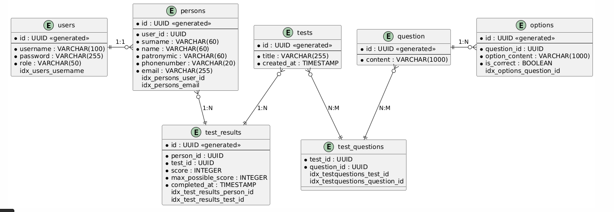

- Далее погрузился в разработку backend-части приложения, создав слои репозиториев,
  сервисов и контроллеров, добавил аутентификацию и авторизацию, прописав обработчики успешной аутентификации
  и добавив кодировку паролей на основе хэш-алгоритма BCrypt. Интегрировал базу данных и применил инструмент миграции FlyWay.
  Особое внимание уделено валидации данных, чтобы избежать некорректных названий и числовых значений.

- Важно отметить, что доступ к платформе предоставляется только после прохождения первичной регистрации, 
  включающей стандартную аутентификацию и ввод личных данных. После этого пользователь может найти нужный тест. 
  В целях безопасности каждый пользователь имеет право изменять только свои персональные данные. 
  Для реализации этого функционала используется Spring Security: система сравнивает данные аутентифицированного 
  пользователя из контекста безопасности Spring с данными на платформе. Если они совпадают - доступ разрешен; 
  в противном случае пользователь перенаправляется на страницу с предупреждением.

- После успешного завершения backend-разработки приступил к созданию пользовательского интерфейса.
  Важно отметить, что для удобства пользователей веб-приложения они могут изменять личные данные сотрудников,
  в случае ошибок, а также просматривать всю информацию о сотрудниках и имеющихся тестах.
  В приложении присутствует удобная навигация между страницами, чтобы пользователь мог перемещаться только
  на нужные представления.

1. В начале пользователей встречает страница регистрации.
- Регистрация

   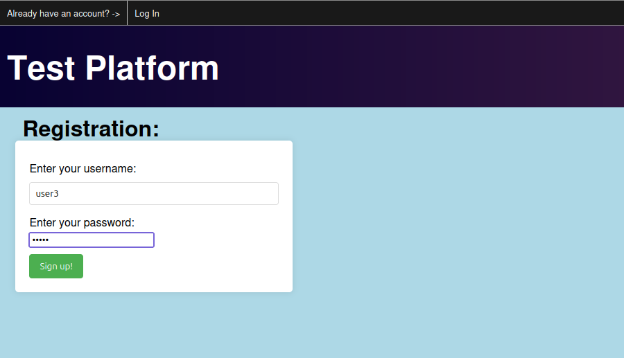
- Вход в систему + демонстрация валидации

  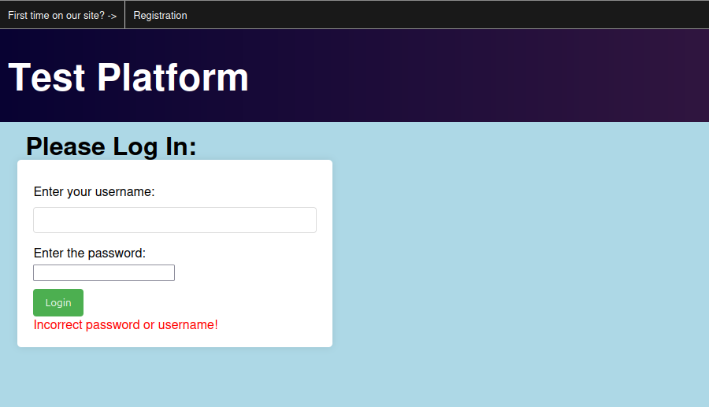
- Ввод личных данных + валидация

  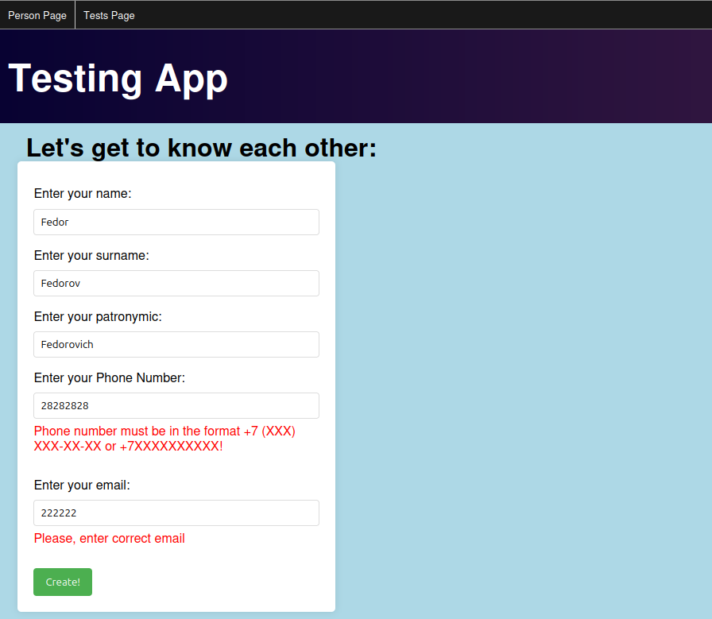

2. После прохождения регистрации и аутентификации пользователь имеет полный
   доступ к платформе и ее содержимому.
- Пользователи приложения

  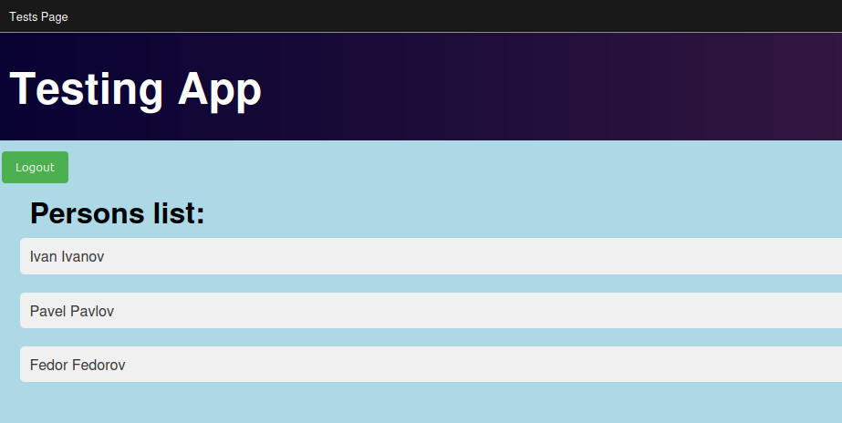
- Просмотр чужих личных данных

  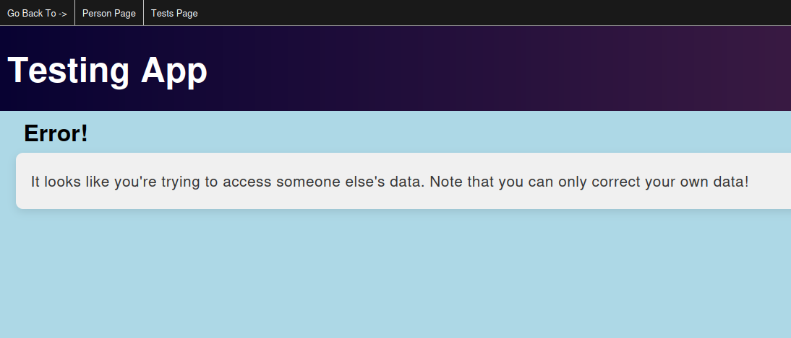
- Просмотр своих личных данных + редактирование 

  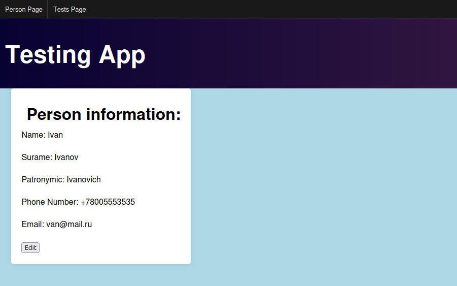
- Страница с тестами

  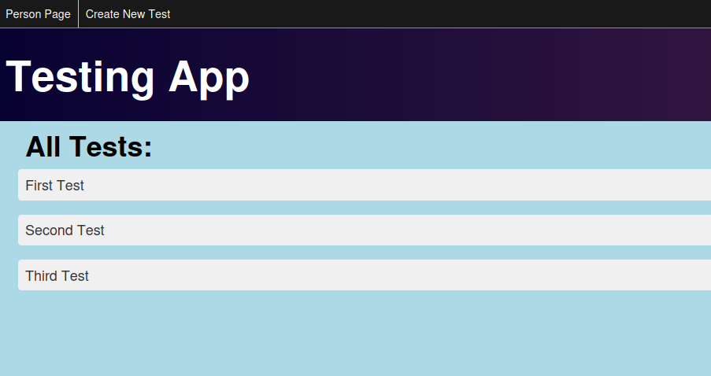

3. Особенностью приложения заключается в том, что не все пользователи могут создавать тесты, а лишь админы. Для этого
   при авторизации каждому пользователю выдается своя роль: ROLE_ADMIN, ROLE_USER. ADMIN - создание, изменение, 
   прохождение тестов, просмотр результата. USER - прохождение тестов, просмотр результата. В случае, 
   если пользователь, не обладающий правами админа попробует создать тест, платформа его об этом предупредит и 
   попросит обратиться к администратору. Результаты тестов сохраняются в отдельных таблицах для каждого пользователя.
- Страница создания теста с добавлением вопроса, вариантов ответа и флага правильного ответа

  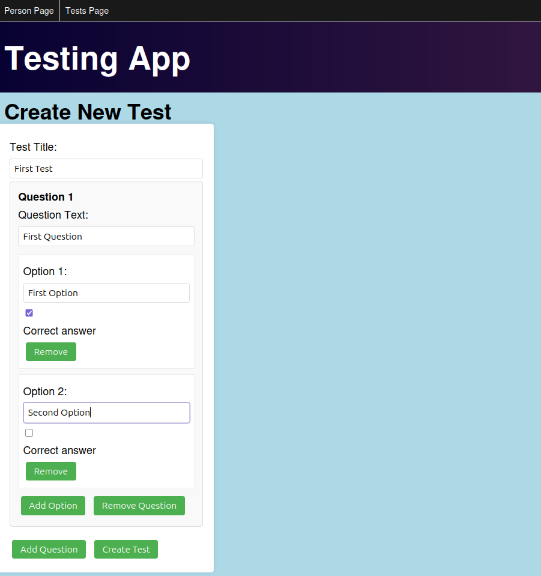
- Ошибка, связанная с отсутствием прав на создание тестов

  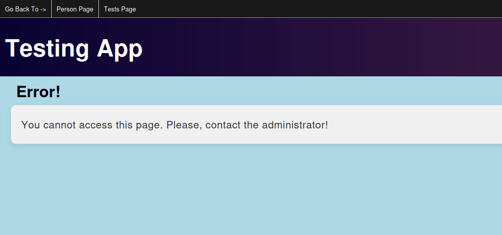
- Отправка теста на проверку

  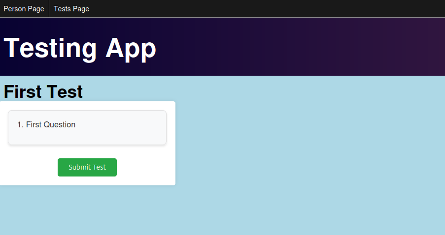
- Результаты теста

  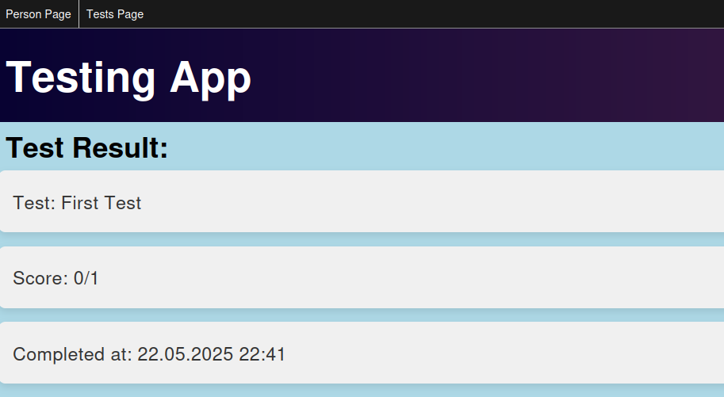

- Далее я поработал над обработкой ошибок и логированием. Все действия в приложении
  логируются. В случае возникновения ошибки, она передается на уровень контроллера ошибок,
  где обрабатывается, а пользователь видит страницу с предложением повторить попытку.

- В завершении работы над проектом я обернул приложение в контейнер Docker и запустил
  вместе с базой данных, используя Docker-compose.

---

### Использованные технологии:
1. Java
2. Spring
3. Spring Security
4. Spring Boot
5. Spring Validator
6. Spring Data
7. Hibernate
8. PostgreSQL
9. Flyway
10. HTML, CSS, Thymeleaf, JS
11. Maven
12. Lombok
13. Docker
---